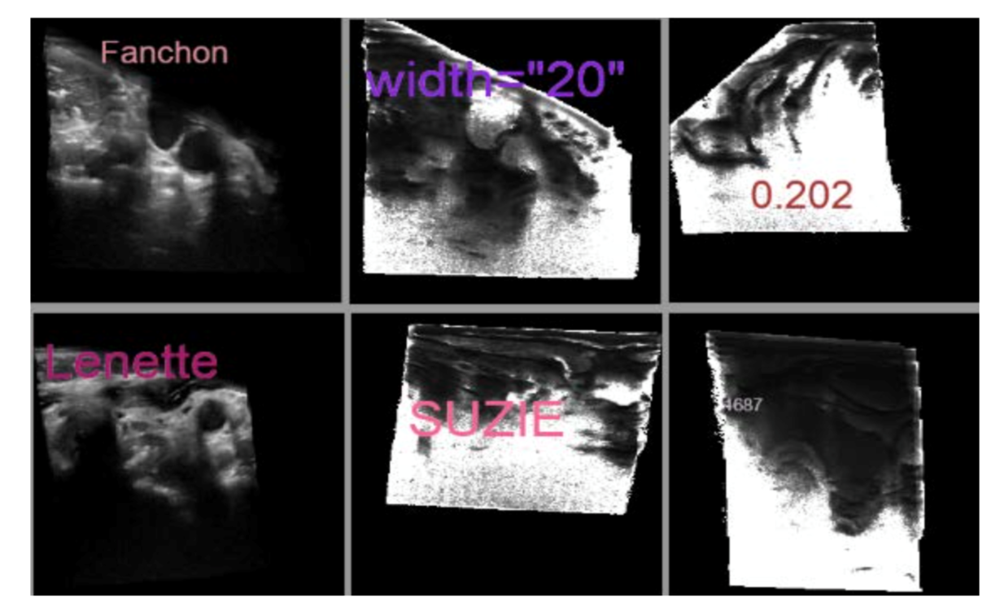

# Generated Pseudo Data for Automatic De-identification of Ultrasound Images

This code was used as a proof of concept for an experiment for the following abstract:
https://cdn.ymaws.com/siim.org/resource/resmgr/siim2019/abstracts/ML_Technique_Goel.pdf

### data generation
`gen-us.py` samples images from Cine US images and combines these images with random strings. During the insertion of strings, the bounding boxes are also stored as labels for the data.

### modeling
`keras-model.py` utilizes the generated data to create a model that predicts the text location in the image.

### examples of generated data 

